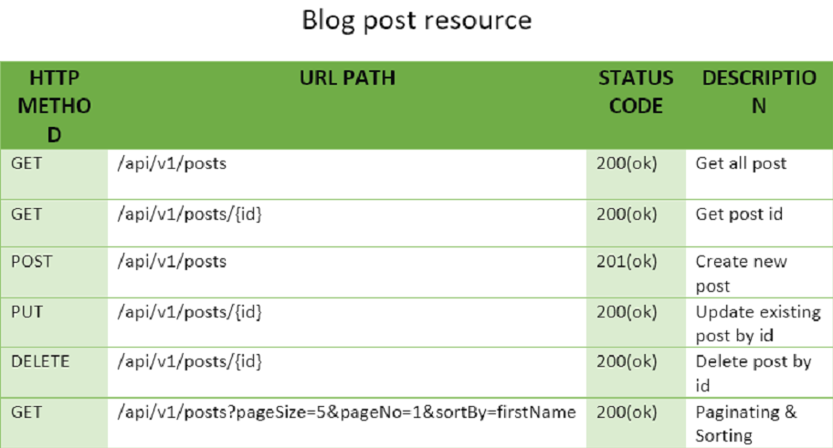
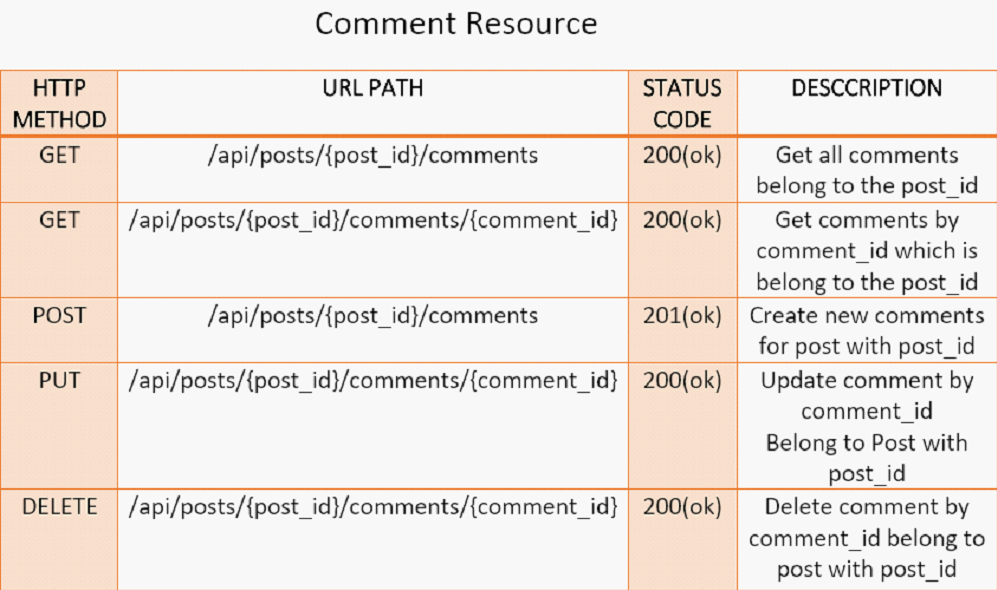

## REST API for blog posts resource -



* Post payload:
```
  {
  "title": "My title",
  "description": "My description",
  "content": "My content" 
   }
```



* Comment payload :
````
{
  "name":"Mishra",
  "email":"mishrasurajit69@gmail.com",
   "body":"Awesome! blog"
}
````